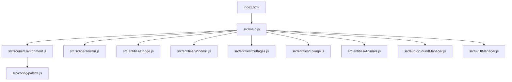

# 🏡 Ngôi Làng Bình Yên 3D (Peaceful Village 3D)

[](https://opensource.org/licenses/MIT)
[](https://threejs.org/)
[](https://vitejs.dev/)

Một ứng dụng Web 3D tương tác mô phỏng "Một ngôi làng thôn quê bình yên" theo phong cách nghệ thuật Low-Poly và Studio Ghibli ấm áp, mộc mạc và thư giãn.

---

## 📑 Mục lục
- [Giới thiệu](#-giới-thiệu)
- [Tính năng nổi bật](#-tính-năng-nổi-bật)
- [Kiến trúc & Công nghệ](#-kiến-trúc--công-nghệ)
- [Cài đặt & Khởi chạy](#-cài-đặt--khởi-chạy)
- [Hướng dẫn sử dụng](#-hướng-dẫn-sử-dụng)
- [Giấy phép](#-giấy-phép)
- [Liên hệ](#-liên-hệ)

---

## 🌿 Giới thiệu
Dự án được xây dựng với triết lý **Zero Missing Assets**: 100% hình học (geometries) và vật liệu (materials) được sinh bằng mã nguồn thủ tục (procedural low-poly), đảm bảo ứng dụng chạy mượt mà 60 FPS mà không phụ thuộc vào bất kỳ file mô hình 3D bên ngoài (`.gltf`/`.glb`) hay file âm thanh tải chậm nào.

---

## ✨ Tính năng nổi bật

1. **Cảnh quan Diorama Phong phú**:
   - **Hòn đảo nổi (Floating Island)**: Địa hình đồi cỏ nhấp nhô, bờ vực đá phiến tự nhiên.
   - **Dòng suối uốn lượn**: Mặt nước chuyển động gợn sóng với bọt ven bờ.
   - **Cây cầu gỗ vòm cong**: Cầu gỗ bắc ngang suối nối liền hai bờ làng.
   - **Cối xay gió ven sông**: Tháp đá gỗ với 4 cánh quạt quay chậm rãi liên tục.
   - **Cụm nhà thôn quê Ghibli**: Mái ngói đỏ/rơm, dầm gỗ mộc mạc, cửa sổ tỏa ánh sáng ấm cúng và ống khói với hạt khói nở dần bay lên trời.
   - **Hệ sinh thái thực vật**: Rừng thông, cây tán tròn pastel, hoa dại rực rỡ và đá cuội (sử dụng `THREE.InstancedMesh`).

2. **Vương quốc Động vật Thân thiện**:
   - **Đàn Cừu**: Lông xù bồng bềnh, gật gù gặm cỏ.
   - **Bò Sữa**: Đốm hoa, lắc đầu nhai cỏ và ve vẩy đuôi.
   - **Đàn Gà**: Nhỏ nhắn, mổ hạt và nhảy nhót lon ton.
   - **Tương tác Raycaster**: Click vào động vật để chúng nhảy cẫng lên vui vẻ kèm âm thanh và bong bóng thoại emoji 3D.

3. **Ánh sáng & Chu kỳ Thời gian**:
   - **3 Chế độ thời gian**: Ban ngày trong lành ☀️, Hoàng hôn mật ong 🌇, Đêm trăng sao lấp lánh 🌙 (cửa sổ rực sáng, đom đóm bay lơ lửng).
   - Đổ bóng mềm chất lượng cao (`PCFSoftShadowMap`).

4. **Âm thanh Không gian Thủ tục (Web Audio API)**:
   - Tổng hợp âm thanh thiên nhiên thuần túy bằng mã nguồn (tiếng gió thoảng, suối chảy róc rách, tiếng chim hót lảnh lót, tiếng kêu của cừu, bò, gà và tiếng cọt kẹt của cối xay).

5. **Giao diện Glassmorphism HUD**:
   - Chuyển đổi nhanh 4 góc nhìn camera: Toàn cảnh, Cối xay gió, Bến cầu, Nông trại.
   - Nút bật/tắt âm thanh thư giãn và hướng dẫn điều khiển trực quan.

---

## 🏗️ Kiến trúc & Công nghệ



- **Runtime**: Three.js (r160+), OrbitControls.
- **Bundler**: Vite 5.x.
- **Audio Engine**: Web Audio API Synthesizer (Zero MP3 files).

---

## 🚀 Cài đặt & Khởi chạy

### Yêu cầu hệ thống
- Node.js version 18.0 trở lên.

### Các bước cài đặt
1. Cài đặt các gói phụ thuộc:
   ```bash
   npm install
   ```

2. Khởi chạy máy chủ phát triển (Dev Server):
   ```bash
   npm run dev
   ```
   Trình duyệt sẽ tự động mở tại địa chỉ `http://localhost:3000`.

3. Kiểm tra tính toàn vẹn (Verification Test):
   ```bash
   node test/verify.js
   ```

4. Đóng gói bản phát hành sản phẩm (Production Build):
   ```bash
   npm run build
   ```

---

## 🎮 Hướng dẫn sử dụng

- **Xoay Camera 360°**: Nhấn giữ chuột trái và kéo.
- **Phóng to / Thu nhỏ (Zoom)**: Cuộn con lăn chuột.
- **Di chuyển góc nhìn (Pan)**: Nhấn giữ chuột phải và kéo.
- **Tương tác**: Click chuột trái vào cối xay gió, nhà cửa hoặc các con vật (cừu, bò sữa, gà) để xem biểu cảm và nghe âm thanh.
- **Chuyển thời gian**: Nhấp vào nút "Ngày", "Hoàng Hôn" hoặc "Đêm" trên thanh điều khiển.
- **Chuyển góc nhìn nhanh**: Nhấp vào các nút góc nhìn ở thanh dưới cùng.

---

## 📄 Giấy phép
Dự án được phân phối dưới giấy phép [MIT](LICENSE).

---

## 👤 Liên hệ
- **Tác giả**: `ntd237`
- **Email**: `ntd237.work@gmail.com`
- **GitHub**: [https://github.com/ntd237](https://github.com/ntd237)
